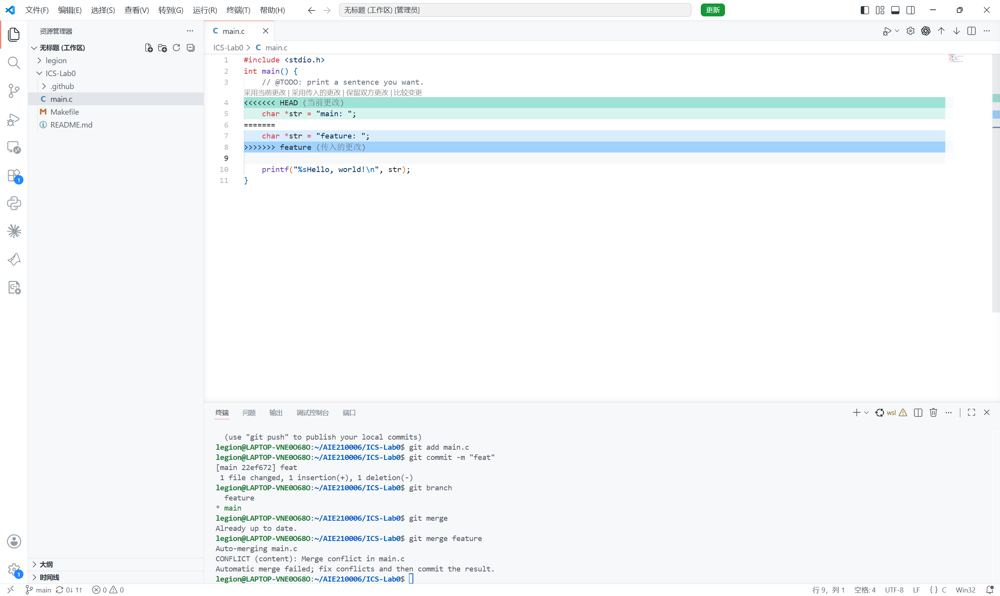
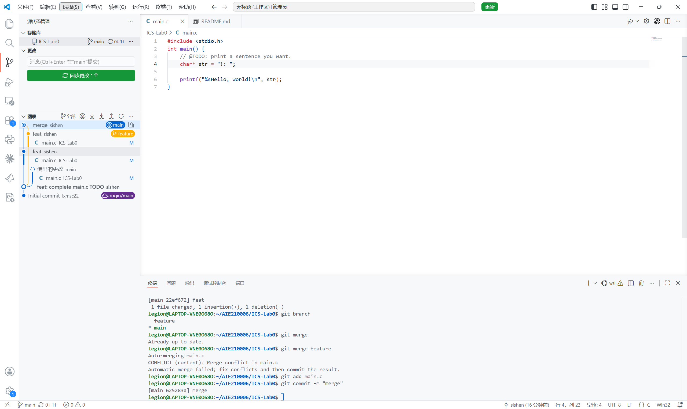

# Lab0：GitLab

## DONE

1. **T1 回答** 

    - **协同开发经历：** 使用过极其简单的 Github 功能，将目标划为互斥的几块，每人只负责自己的一块，同一合并到 Github 上。
    - **为什么分为暂存与提交？** 暂存区用于选择本次提交的修改，提交则将这些修改记录为一个版本。这样可以把不同目的的修改分开，并保持流程清晰明了。
    - **两种 branch 命令的区别：**`git branch` 显示本地分支；`git branch -a` 同时显示本地分支和远程跟踪分支，反映本地记录的远程状态（不会联网更新）。

2. **T3 回答** 

    - **[Commit Message 规范](https://www.ruanyifeng.com/blog/2016/01/commit_message_change_log.html)：** 文章介绍了 `type(scope): subject` 格式以及可选的正文和页脚，该规范对 Git 提交信息制定了严格的结构化格式，提高代码可读性，便于查看历史、筛选提交和生成更新日志。
    - **[语义化版本](https://semver.org/lang/zh-CN/)：** 版本号采用“主版本号.次版本号.修订号”。不兼容的 API 修改递增主版本号，兼容的新功能递增次版本号，兼容的问题修复递增修订号。

    **为什么学习 Git？** Git 能记录修改、比较差异和回溯版本，也支持通过分支并行开发与合并代码，能清晰分工配合清晰，减少协作混乱，方便定位问题。

3. **T2&T4 流程**

    1. 使用课程模板创建个人仓库，通过 `git clone` 克隆到本地。
    2. 修改 `main.c` 的 TODO，通过 `git add main.c` 和 `git commit` 提交。
    3. 创建 `feature` 分支，在该分支和 `main` 分支分别将 `str` 改成不同字符串，各提交一次。
    4. 回到 `main` 执行 `git merge feature`，记录冲突。
    
    5. 手动确定最终内容、删除冲突标记，再暂存并提交，完成合并。
    

4. 在 `main` 提交报告和截图，执行 `git push` 上传
